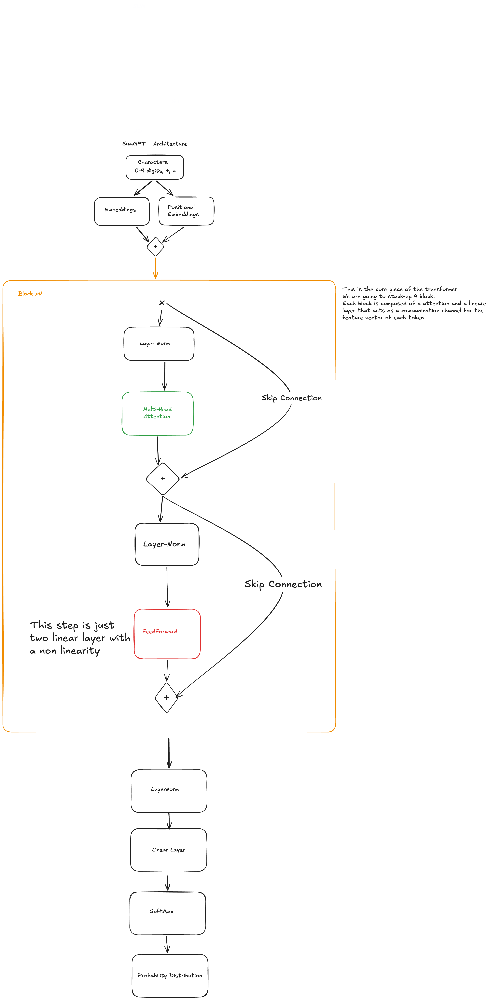

Just a little esperiment, training a custom GPT from the original paper on the task of summing three digits numbers in a reversal order.
The architecture is pretty straightforward, just adapted to work with that task, the other code is just boilerplate for training and for inference. 
Took something like 3 min to train on my GPU, maybe a bit longer on CPU.

In the repo is also present the trained checkpoint so you can use that to train with inference.py, give it a spin!
I also indexe it using deep-wiki: https://deepwiki.com/T-vaccari/SumGPT/1-sumgpt-overview

